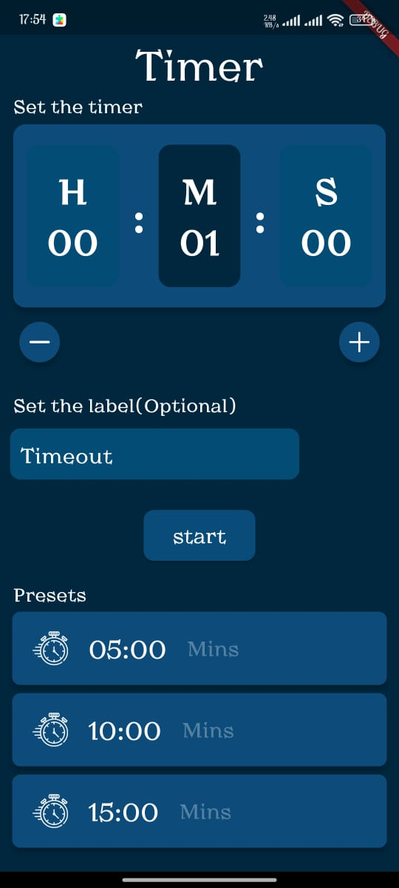
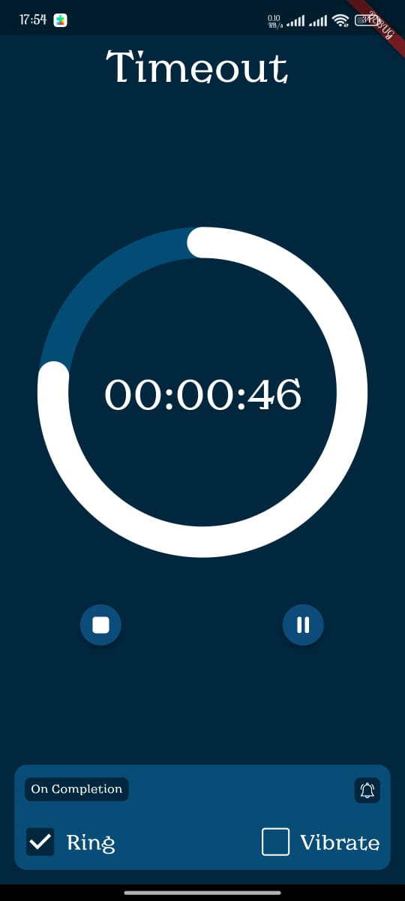

# Timer Mobile App
In this project I have created a Timer App using Dart and Flutter. It is a simple project that countsdown time and rings or vibrates when it's down.

Run the ` timer\lib\main.dart ` file to start the app. Enjoy!

## Overview

### Issues Encountered
- Inbuilt Icons don't work meaning you have to download and add them to the project.
- Audio doesn't work meaning that the ring option doesn't work. I have tried Audioplayer and justaudio libraries but haven't been successful

### Credit
All icons have been provided by [FlatIcon](https://www.flaticon.com/)
